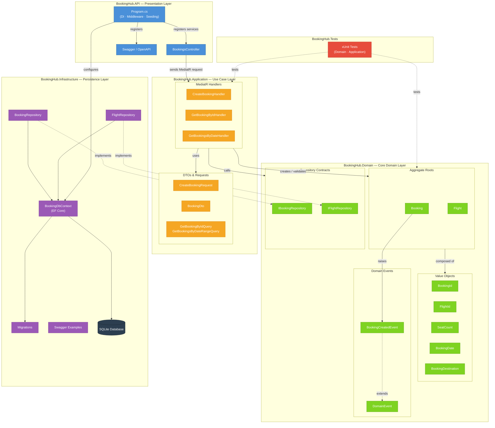
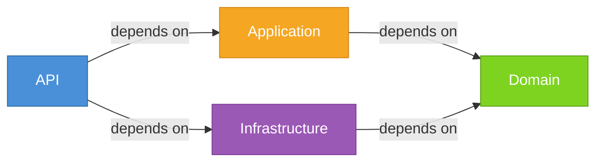
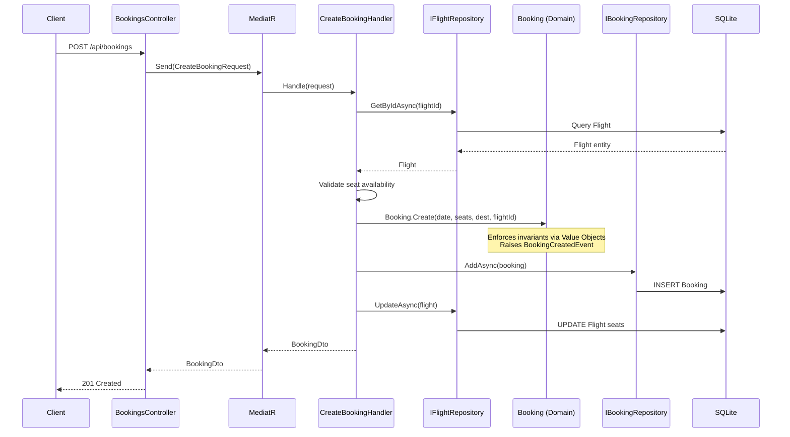

# 🎟️ BookingHub

A minimal, high-performance airline-style booking system built with **.NET 8**, focusing on **Domain-Driven Design (DDD)** and **Clean Architecture** principles.

---

## 🚀 Overview
BookingHub demonstrates how to build a scalable, maintainable backend by isolating business logic from infrastructure. Key features include:
* **Domain Modeling:** Robust entities and value objects for Bookings and Flights.
* **Business Invariants:** Strict enforcement of rules (e.g., seat availability, date validation) within the Domain layer.
* **Persistence:** EF Core with SQLite provider.
* **Date Queries:** Efficient range-based filtering for booking records.

## 🏗️ Architecture
The project follows a layered approach where dependencies point inwards:
**API** → **Application** → **Domain** ← **Infrastructure**

| Layer | Responsibility |
| :--- | :--- |
| **Domain** | Entities, Value Objects, Domain Events, and Core Interfaces. |
| **Application** | Use cases (MediatR handlers), DTOs, and Request Mapping. |
| **Infrastructure** | EF Core DbContext, Repository implementations, and Migrations. |
| **API** | Minimal Controllers, Swagger integration, and Request Validation. |

### Architecture Diagram



#### Dependency Rule



> **Domain** is the innermost layer with zero external dependencies. **Infrastructure** implements Domain interfaces (Dependency Inversion Principle). **Application** orchestrates use cases via MediatR. **API** is the entry point that wires everything together.

#### Request Flow



## 🧠 Key DDD Concepts
* **Aggregate Roots:** `Booking` and `Flight` ensure data consistency.
* **Value Objects:** `BookingId`, `FlightId`, and `SeatCount` prevent "primitive obsession."
* **Domain Events:** `BookingCreatedEvent` handles decoupled side effects.
* **Business Rules:** * Seat counts must be greater than zero.
    * Backdated bookings are prohibited.
    * Bookings cannot exceed a flight's total seat capacity.

## 🌐 API Endpoints
| Method | Endpoint | Description |
| :--- | :--- | :--- |
| `POST` | `/api/bookings` | Create a new flight booking |
| `GET` | `/api/bookings/{id}` | Retrieve booking details by ID |
| `GET` | `/api/bookings/bydaterange` | Filter bookings by `startDate` & `endDate` |

## 🗄️ Persistence & Data
* **Engine:** EF Core + SQLite.
* **Mappings:** Value Objects are mapped using EF Conversions.
* **Seed Data:** Pre-configured flights included:
    * Delhi → Mumbai (100 seats)
    * Bangalore → Hyderabad (50 seats)

## 🧪 Testing
The solution includes **xUnit** tests for the Domain and Application layers, utilizing an in-memory database provider to ensure logic reliability without infrastructure overhead.

## ▶️ Run Locally
1. **Clone the repository.**
2. **Update the database:**
   ```bash
   dotnet ef database update -p BookingHub.Infrastructure -s BookingHub.API

## 🚀 Future Roadmap

### 1. Reliability & Consistency

- **Transactional consistency**  
  Introduce a unit of work or explicit EF Core transaction so creating a booking and updating flight seats are atomic.

- **Concurrency control**  
  Add optimistic concurrency checks (rowversion / concurrency tokens) for `Flight` to safely handle simultaneous seat bookings.


### 2. Domain Events & Integration

- **Domain event dispatch**  
  Wire `BookingCreatedEvent` into an event dispatcher (e.g. MediatR notifications or a custom dispatcher) and implement handlers for side effects (e.g. notifications, projections, audit logs).

- **Transactional outbox**  
  Implement a transactional outbox pattern so domain events are persisted with the main transaction and published reliably to external systems (e.g. message bus).


### 3. Validation & Error Handling

- **Centralized validation**  
  Add request validation (e.g. FluentValidation) to enforce input rules before handlers execute.

- **Consistent error responses**  
  Introduce global exception handling middleware to standardize error payloads (`ProblemDetails`), and map domain/validation/business exceptions to appropriate HTTP status codes.


### 4. Testing & Quality

- **Unit tests**  
  Add tests for value objects, entities (`Flight.ReduceAvailableSeats`, `Booking.Create`), and application handlers (happy paths and edge cases).

- **Integration tests**  
  Add tests against a real or in-memory SQLite database to validate repository behavior and end-to-end booking flows.

- **API tests**  
  Use `WebApplicationFactory` to exercise HTTP endpoints and verify status codes, contracts, and error handling.


### 5. Features & Extensibility

- **Flight search & listing**  
  Add endpoints to search flights by route/date and expose the currently seeded flights.

- **Cancellation & modification flows**  
  Implement booking cancellation and modification use cases, including returning seats to flights and enforcing new invariants.

- **User / customer context**  
  Introduce a customer or user concept, link bookings to customers, and consider authentication/authorization for protected endpoints.

- **Pagination & filtering**  
  Extend query endpoints with pagination, sorting, and richer filters for bookings and flights.


### 6. Architecture & Operational Concerns

- **Configuration & environments**  
  Split configuration for local/dev/prod (connection strings, logging levels) and add environment-specific appsettings.

- **Observability**  
  Add structured logging, basic metrics, and request tracing to support diagnostics in real environments.

- **Database evolution**  
  Harden migration strategy for production (explicit migration commands, versioning, and rollback approach).
